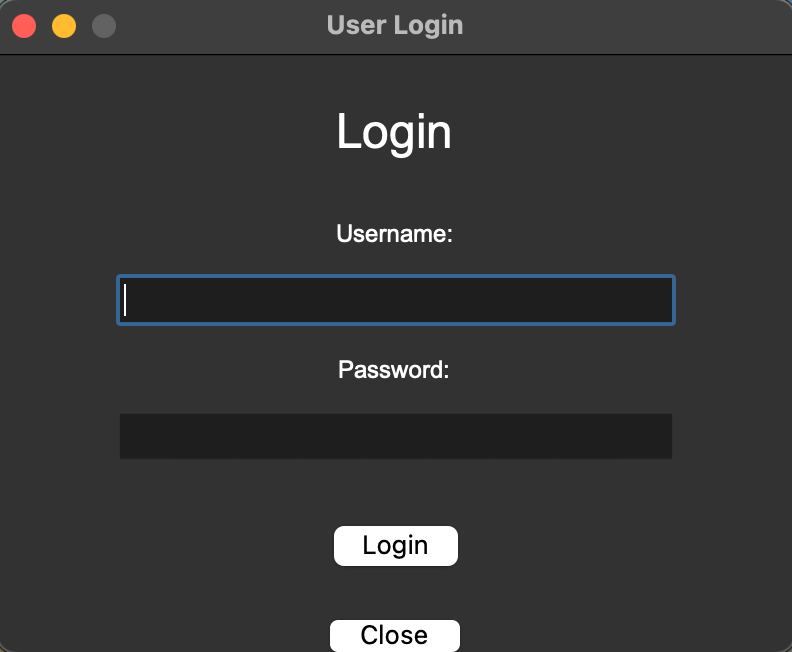
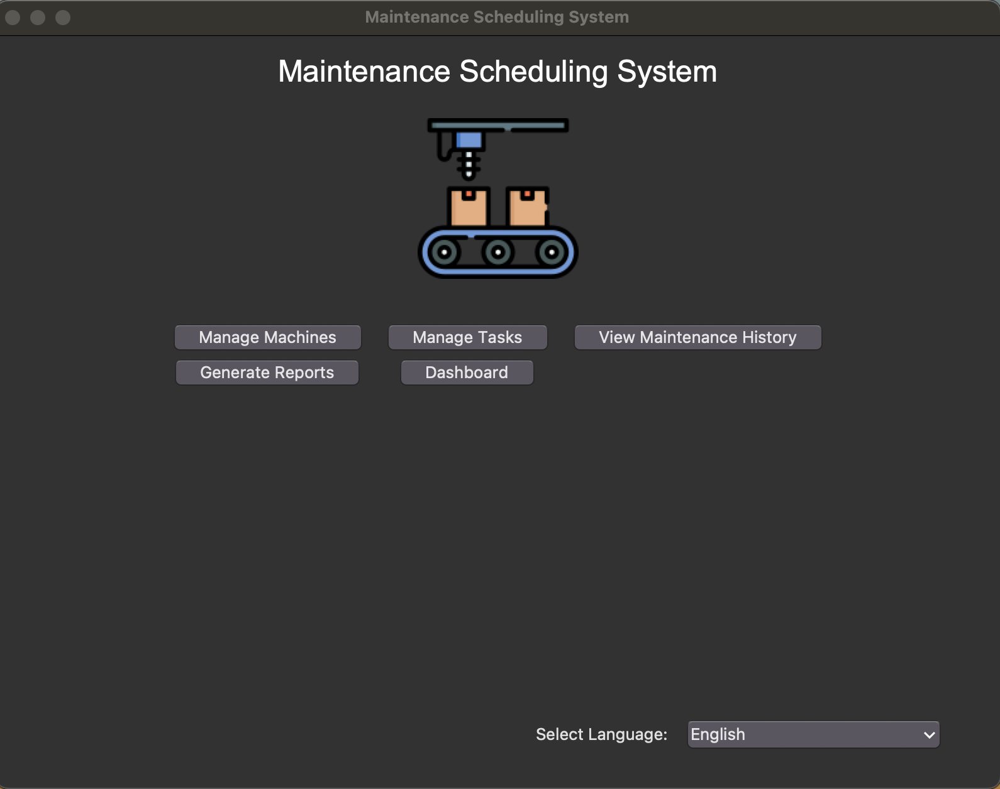
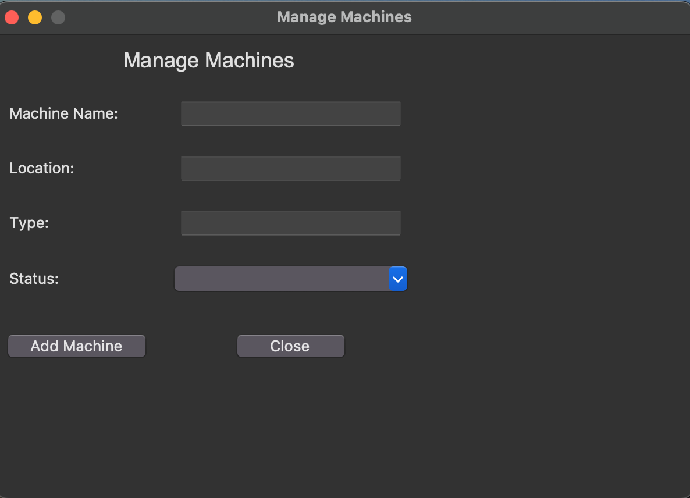
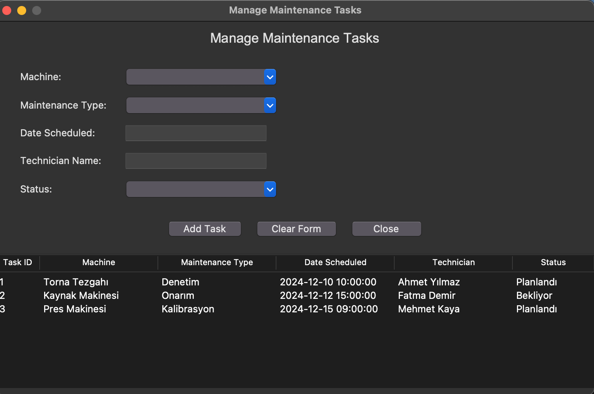
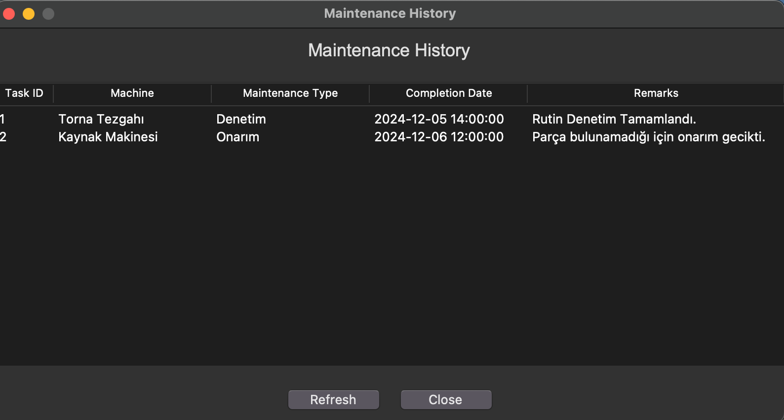
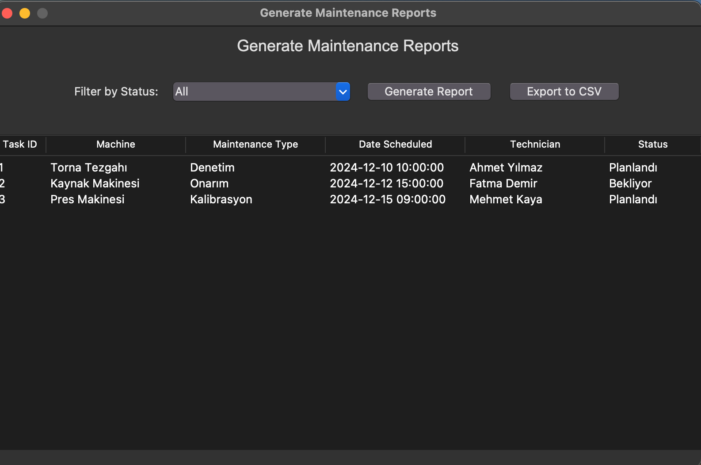
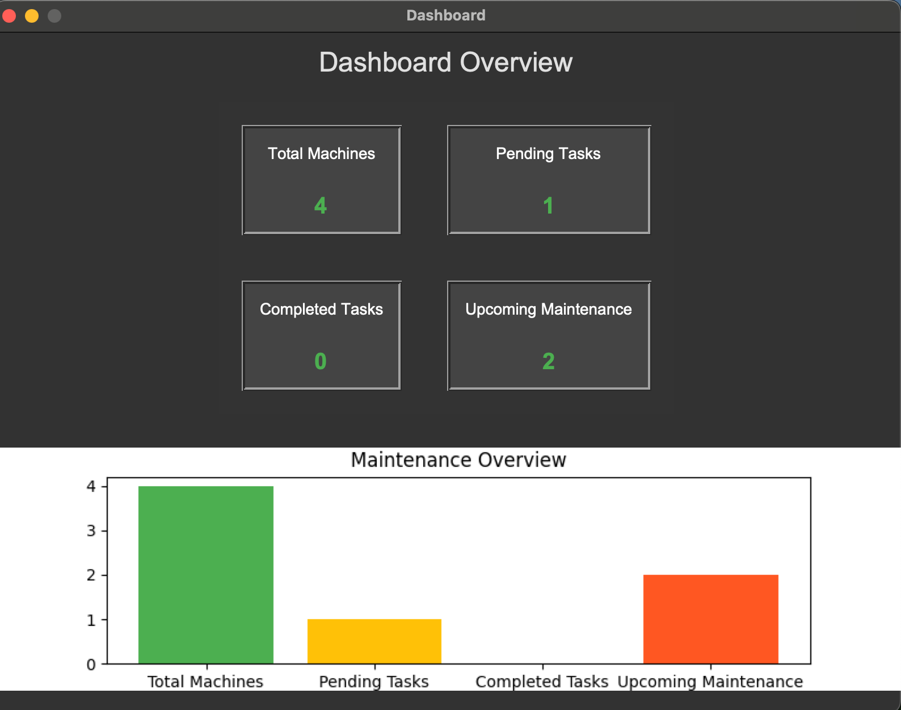

# Maintenance Scheduling System

## Overview
The **Maintenance Scheduling System** is a Python-based desktop application that uses Tkinter for its graphical user interface (GUI) and SQLite for data storage. It helps organizations manage and schedule maintenance tasks efficiently, track machine status, and generate reports. The project supports Turkish and English languages.

---

## Features

1. **User Management**
   - Secure login functionality with role-based access.

2. **Machine Management**
   - Add, view, and update machine details, such as:
     - Name
     - Location
     - Type
     - Status (e.g., Operational, Maintenance Required, Offline).

3. **Task Management**
   - Schedule maintenance tasks for machines.
   - Track task statuses (Pending, Completed, Scheduled).

4. **Maintenance History**
   - View completed maintenance tasks.
   - Automatically updates task history upon completion.

5. **Dashboard**
   - Displays an overview of:
     - Total Machines
     - Pending Tasks
     - Completed Tasks
     - Upcoming Maintenance
   - Visualizes metrics with an interactive **bar chart**.

6. **Report Generation**
   - Filter maintenance tasks by status (e.g., Pending, Scheduled, Completed).
   - Export filtered results to a CSV file.

7. **Internationalization**
   - Supports **English** and **Turkish** languages for the UI.

---

## Project Structure

```
MaintenanceSchedulingSystem/
│
├── assets/                         # Images (icons, reports, architecture)
│   ├── design
│   ├── report
│   ├── screenshots
│   ├── icon.png
│
├── database/
│   ├── db_setup.py
│   ├── sample_data.py
├── gui/
│   ├── dashboard.py                # Dashboard with cards and charts
│   ├── login.py                    # Login window
│   ├── main_window.py              # Main window with navigation
│   ├── machine_management.py       # Manage machines
│   ├── maintenance_history.py      # View maintenance history
│   ├── report_generation.py        # Generate and export reports
│   ├── task_management.py          # Manage maintenance tasks
│
├── main.py                         # Entry point of the application
├── requirements.txt                # Dependencies list
├── maintenance.db                  # Sqlite database
└── README.md                       # Documentation (this file)
```

---

## Installation

Follow these steps to set up and run the project on your system.

### **1. Clone the Repository**
```bash
git clone https://github.com/erogluegemen/MaintenanceSchedulingSystem.git
cd MaintenanceSchedulingSystem
```

### **2. Install Dependencies**
Ensure Python 3.13.0 is installed. Install required libraries using the following command:

```bash
pip install -r requirements.txt
```

### **3. Initialize the Database**
Run the database setup script to create necessary tables and seed sample data:

```bash
python database/db_setup.py
```

```bash
python database/sample_data.py
```

### **4. Run the Application**
Start the application using the following command:

```bash
python main.py
```

---

## Usage

### **Main Window**
- The **Main Window** serves as the navigation hub.
- Buttons allow you to open:
   - Machine Management
   - Task Management
   - Maintenance History
   - Dashboard
   - Report Generation

### **Dashboard**
- Displays an overview of key metrics.
- Visualizes metrics using a **bar chart**.

### **Machine Management**
- Add new machines with their details.
- View existing machines.

### **Task Management**
- Schedule maintenance tasks for machines.
- Update task statuses.

### **Maintenance History**
- View completed maintenance records.

### **Report Generation**
- Filter tasks by status (e.g., Pending, Completed, Scheduled).
- Export filtered data as a CSV file.

---

## Screenshots

## Login Window:


### Main Window:


### Machine Management:


### Task Management:


### Maintenance History:


### Report Generation:


### Dashboard Overview:


---

## Internationalization (i18n)

- Language options are available at the bottom-right corner of the **Main Window**.
- Supports:
   - **English**: Default language.
   - **Türkçe**: Translated labels and buttons.

---

## Future Improvements

1. User Authentication with Password Hashing.
2. Add machine-specific maintenance schedules.
3. Email reminders for upcoming maintenance tasks.
4. Multi-user support with permission levels.

---

## Contributing

Contributions are welcome! Follow these steps to contribute:
1. Fork the repository.
2. Create a feature branch.
3. Commit your changes.
4. Push the branch and open a Pull Request.

---

## Contact

For any questions or support, contact:

- **Egemen Eroglu**  
- **GitHub**: [@erogluegemen](https://github.com/erogluegemen)

---
